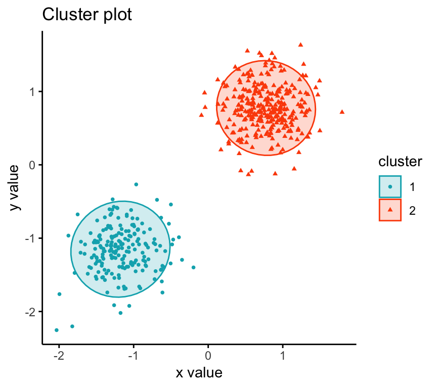

## 


## Preface

Web GIS adalah salah satu solusi untuk publikasi sistem informasi geografis yang dapat diakses lebih flexibel antar platform tanpa memerlukan instalasi aplikasi, dengan cukup mengakses melalui browser kita dapat menampilkan dan menggunakan sistem informasi geografis terutama dalam bentuk Peta digital. 11 tahun yang lalu Volodymyr Agafonkin membuat sebuah library open source bernama [leaflet](https://github.com/Leaflet/Leaflet) dengan sampai sekarang memiliki 700 lebih contributor dan 34 ribu stars di github. Leaflet memiliki banyak fitur dari dasar yaitu visualisasi peta dasar sampai plugins plugins yang dibuat komunitas yang sangat banyak.


```js title="baisc map init in leaflet"
var map = L.map('map').setView([51.505, -0.09], 13);

L.tileLayer('https://{s}.tile.openstreetmap.org/{z}/{x}/{y}.png', {
    attribution: '&copy; <a href="https://www.openstreetmap.org/copyright">OpenStreetMap</a> contributors'
}).addTo(map);

L.marker([51.5, -0.09]).addTo(map)
    .bindPopup('A pretty CSS3 popup.<br> Easily customizable.')
    .openPopup();
```

## Leaflet Marker
Leaflet marker adalah reperesentasi titik lokasi pada peta dari spatial data, leaflet secara out of the box sudah support untuk menampilkan marker dan dapat di konfigurasi sesuai kebutuhan, untuk data dengan kuantitas yang tidak terlalu banyak tidak akan terjadi problem, namun ketika ada keperluan untuk menampikan data yang banyak dan besar, lefalet akan membuat element di atas base map semakin banyak semakin membuat browser bekerja keras bahkan crash.


Ini bukan problem dari leafletnya namun adalah bagaiman dari kita melakukan pendekatan untuk menampilkan data yang banyak secara lebih efisien, apalagi jika data kita sudah sangat banyak, banyak cara atau pendekatan yang dapat dilakukan mulai dari trnasformasi data misalkan dari point lokasi yang sangat banyak di lakukan pengelompokan ubah menjadi heatmap atau convex hull, atau pendekatan lain untuk me reduce data, dan cara yang lainya adalah menggunakan teknik clustering.

## Clustering

clustering adalah proses pengelompokan beberapa point location atau marker location. Ada beberapa teknik dan algoritma yang dapat digunakan salah satunya yang akan di pakai di artikel ini adalah kd tree, dimana akan emncari nearest neighboor dari point lokasi. 




processnya adalah dengan mencari point terdekat berdasarkan radius yang ditentukan lalu melakukan counting dan elminasi point lokasi sehingga menyisakan satu point lokasi saja.


leflet sendiri memiliki plugins marker cluster untuk handle kasus peng klusterna ini, namun terbatas pada sisi browser atau client saja karena plugins tersebut adalah extensi dari leaflet sehingga akan sedikit sulit untuk membawanya ke sisi server/backend. [supercluster](https://github.com/mapbox/supercluster) adalah library yang dibuat oleh team mapbox untuk dapat melakukan clustering secara terpisah dari leaflet sehingga processnya dapat dipisah dari browser, tujuanya adalah untuk memperingan kerja browser dalam melakukan rendering banyak data dan tidak membuat aplikasi kita crash.

## Server side clustering

seperti pada pembahasan section sebelumnya, bahwa [supercluster](https://github.com/mapbox/supercluster) adalah library yang dibuat oleh team mapbox untuk dapat melakukan clustering secara terpisah dari leaflet sehingga processnya dapat dipisah dari browser. untuk dapat melakukan teknik clustering dengan data yang besar tanpa membuat palikasi disisi client/browser menjadi hang atau crash karena proses rendering yang berat kita dapat melakukan pendekatan dengan memisahkan proses clustering dari browser ke sisi server dan melakukan filtering point location berdasarkan bounding box menggunakan postgis dengan mengamati bounding box pada view leaflet di sisi client  dengan tujuan untuk menapatkan proses yang lebih efisien lagi.


proses yang dilakukan di sisi server ketika menggunakan pendeketan server side adalah select filter -> clustering -> send response kurang lebih untuk proses data seperti berikut :


untuk dapat lebih wise lagi ada baiknya untuk membatasi max zoom dari map untuk menghindari proses klustering yang terlalu banyak namun tidak harus.

untuk sampai saat ini [supercluster](https://github.com/mapbox/supercluster) dapat berjalan pada browser atau pada server dengan menggunakan Nodejs runtime. Akan sangat menarik jika dapat dilakukan porting ke bahasa lain dan mengimplementasikan konkurensi untuk menambah performa kecepatan clustering.


## Percobaan

Untuk percobaan kita akan membuat sistem pemetaan sangat sederhana yaitu memetkana lokasi pengguna tweeter. untuk datanya kita dapatkan dari Kaggle di dataset berikut :
- [Twitter Connections with User Location](https://www.kaggle.com/datasets/sajidhasanapon/twitter-connections-with-user-location)
dataset ini memiliki beberapa file yang akan digunakan adalah versi 1 juta data, file tersebut memiliki size `38 MB` dan ketika di konversi ke geojson size nya menjadi `230mb`

- untuk database menggunakan Postgres dengan tambahan postgis untuk operasi spatial dan supaya dapat melakukan envelop pada sisi databse. Pada percobaan ini hanya menggunakan satu tabel seperti berikut :


- untuk melakukan seeding perlu sudah kita siapkan script untuk melakukan itu di https://github.com/alfiankan/leaflet-server-side-marker-cluster.git, jalankan dengan node runtime `node import.js` pastikan sebelum menjalankan sudah merubah konfigurasi databse sesuai yang anda gunakan


#### Membuat API
kita akan menggunaka NodeJS runtime dan typescript untuk emmbuat location http API. anda dapat melakukan clone dari repository yang kita buat `git clone https://github.com/alfiankan/leaflet-server-side-marker-cluster.git` berikut adalah penjelasnya :

1. Location Repository
pada class ini terdapat method untuk melakukan query ke postgres dengan extensi postgis yaitu envelop dimana digunakan untuk melakukan seleksi point lokasi pada bounding box yang telah ditentukan

```typescript title="api/repositories/Locations.ts"

import { DatabaseError, Pool, QueryResult } from "pg";
import { Point } from "../entities/Point";

class Locations {
    private db: Pool
    constructor(pool: Pool) {
        this.db = pool
    }

    getPointsInsideBoundingBox(west: string, south: string, east: string, north: string): Promise<QueryResult<any>> {
        return this.db.query({
            text: "SELECT id, ST_Y(location) AS y, ST_X(location) as x FROM marker_cluster u WHERE location && ST_MakeEnvelope($1, $2, $3, $4, 4326)",
            values: [west, south, east, north]
        })
    }

}

export { Locations }

```

2. Clustering Use Case
Pada class ini berisi use case untuk melakukan clustering dengan library [supercluster](https://github.com/mapbox/supercluster) dimana library ini menggunakan kdbush (kd tree) untuk teknik clustering nya. pada proses ini juga dilakukan transformasi ke DTO GeoJSON.

```typescript title="api/usecases/LocationCluster.ts

import { Locations } from '../repositories/Locations'
import Supercluster = require('supercluster')

class LocationCluster {
    private locationRepository: Locations
    constructor(locationsRepository: Locations) {
        this.locationRepository = locationsRepository
    }

    async getClusteredPoint(west: number, south: number, east: number, north: number, zoom: number): Promise<Array<Supercluster.ClusterFeature<any>>> {
        const [locations] = await Promise.all([
            this.locationRepository.getPointsInsideBoundingBox(
                String(west),
                String(south),
                String(east),
                String(north),
            )
        ])

        // converting to .geojson features array
        let geojson = new Array<any>()
        locations.rows.map(point => {
            geojson.push({
                "type": "Feature",
                "geometry": {
                    "type": "Point",
                    "coordinates": [point.x, point.y]
                },
                "properties": {
                    "name": point.id
                }
            })
        })

        const clustersIndexes = new Supercluster({
            log: true,
            radius: 80,
            maxZoom: 17
        });

        clustersIndexes.load(geojson)


        return clustersIndexes.getClusters([west, south, east, north], zoom)
    }

}

export { LocationCluster }

```

3. HTTP Handler
untuk handling request kita menggunaka expressjs dengan endpoint `/points` dengan query params bounding box dan zoom uyang kita dapat dari leaflet, kurang lebih akan berbentuk seperti berikut

```js title="location request"
http://localhost:3000/points?west=-74.37604665756227&south=40.74525741379786&east=-74.34858083724977&north=40.75104456155781&zoom=16
```

4. Map Client
untuk menampilkan peta dan marker cluster kita menggunakan leaflet, pada percobaan ini kita hanay membuat satu file html dengan js script di dalamnya untuk handling leafelt nya, pada client terdapat algoritma untuk menyesuaikan icon marker cluster dan menampilkan total point location dari sebuah cluster berikut adlah potongan javascript dari index.html

```js title="public/index.html"

        const loading = document.getElementById('loading')
        let isLoading = false
        function getJSON(url, callback) {

            const xhr = new XMLHttpRequest();
            xhr.open('GET', url, true);
            xhr.responseType = 'json';
            xhr.setRequestHeader('Accept', 'application/json');
            xhr.onload = function () {
                if (xhr.readyState === 4 && xhr.status >= 200 && xhr.status < 300 && xhr.response) {
                    callback(xhr.response);
                }
            };
            xhr.send();
        }

        const map = L.map('map').setView([0, 0], 2);

        L.tileLayer('https://{s}.tile.openstreetmap.org/{z}/{x}/{y}.png', {
            attribution: '&copy; <a href="http://osm.org/copyright">OpenStreetMap</a> contributors'
        }).addTo(map);

        const markers = L.geoJson(null, {
            pointToLayer: createClusterIcon
        }).addTo(map);


        function update() {

            if (isLoading) {
                return
            }
            isLoading = true

            const bounds = map.getBounds();
            console.log(bounds)
            console.log({
                bbox: [bounds.getWest(), bounds.getSouth(), bounds.getEast(), bounds.getNorth()],
                zoom: map.getZoom()
            });

            console.log(bounds.getWest(), bounds.getSouth(), bounds.getEast(), bounds.getNorth(), map.getZoom())

            loading.innerHTML = `Processing ...`
            const before = new Date();
            getJSON(`http://localhost:3000/points?west=${bounds.getWest()}&south=${bounds.getSouth()}&east=${bounds.getEast()}&north=${bounds.getNorth()}&zoom=${map.getZoom()}`, (geojson) => {
                console.log(geojson);
                markers.clearLayers();
                markers.addData(geojson);

                const now = new Date();
                const diff = now - before;
                loading.innerHTML = `Took  ${diff} milliseconds`
                isLoading = false
            });
        }

        map.on('moveend', update);

        map.whenReady(update);


        function createClusterIcon(feature, latlng) {

            if (!feature.properties.cluster) {

                const tweetIcon = L.icon({
                    iconUrl: 'http://localhost:3000/twitter.svg',
                    iconSize: [40, 40], // size of the icon
                });
                let singleMarker = L.marker(latlng, { icon: tweetIcon }).bindPopup(feature.properties.name);
                singleMarker.on('mouseover', function (e) {
                    this.openPopup();
                });
                singleMarker.on('mouseout', function (e) {
                    this.closePopup();
                });
                return singleMarker
            }

            const count = feature.properties.point_count;
            const size =
                count < 100 ? 'small' :
                    count < 1000 ? 'medium' : 'large';
            const icon = L.divIcon({
                html: `<div><span>${feature.properties.point_count_abbreviated}</span></div>`,
                className: `marker-cluster marker-cluster-${size}`,
                iconSize: L.point(40, 40)
            });

            return L.marker(latlng, { icon });
        }

```

untuk mengakses map client dapat diakses dari root path di `http://localhost:3000`

5. Uji coba

- untuk live demo dapat diakses melalui playground Petaku platform [demo clustering](https://playground.petaku.xyz/clustering), Development of Petaku GIS Platform, No Code Easy to use GIS Platform


## Wrap it up

begitulah salah satu pendektana untuk handle juataan data point lokasi pada leaflet dengan teknik server side clustering, tentu akan banyak hal yang dapat di improve maka dari itu tetap keep exploring. terimakasih...